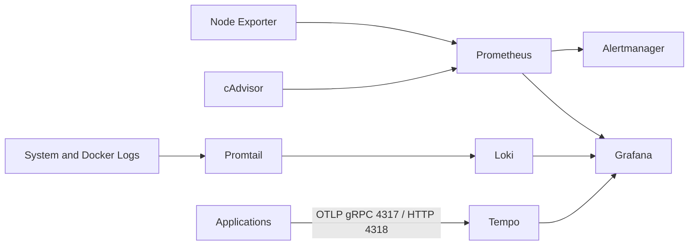

# Docker Observability Lab

A hardened Docker Compose observability stack for a personal DevOps portfolio. The lab collects host metrics, container metrics, Docker/system logs, and OTLP traces, then exposes them through Grafana with provisioned data sources and starter dashboards.

## Table of Contents

- [Architecture](#architecture)
- [Components](#components)
- [Features](#features)
- [Repository Structure](#repository-structure)
- [Prerequisites](#prerequisites)
- [Installation](#installation)
- [Environment Setup](#environment-setup)
- [Prometheus Basic Auth](#prometheus-basic-auth)
- [Operations](#operations)
- [Health Checks](#health-checks)
- [Prometheus Reload API](#prometheus-reload-api)
- [Grafana Provisioning](#grafana-provisioning)
- [Local URLs](#local-urls)
- [Example PromQL](#example-promql)
- [Example LogQL](#example-logql)
- [Trace Exploration](#trace-exploration)
- [Alerting Workflow](#alerting-workflow)
- [Troubleshooting](#troubleshooting)
- [Security and Hardening Notes](#security-and-hardening-notes)
- [Known Limitations](#known-limitations)
- [Future Improvements](#future-improvements)
- [License](#license)

## Architecture



## Components

| Component | Image | Purpose | Local Port |
| --- | --- | --- | --- |
| Grafana | `grafana/grafana:11.5.2` | Dashboards, explore, data source UI | `3000` |
| Prometheus | `prom/prometheus:v3.5.0` | Metrics scraping, rules, alert evaluation | `9090` |
| Alertmanager | `prom/alertmanager:v0.28.1` | Alert grouping and routing | `9093` |
| Loki | `grafana/loki:3.4.2` | Log storage and LogQL queries | `3100` |
| Promtail | `grafana/promtail:3.4.2` | System and Docker log collection | internal `9080` |
| Tempo | `grafana/tempo:2.7.2` | Local trace storage and OTLP ingestion | `3200`, `4317`, `4318` |
| Node Exporter | `prom/node-exporter:v1.9.1` | Host metrics | `9100` |
| cAdvisor | `gcr.io/cadvisor/cadvisor:v0.49.2` | Docker container metrics | `8080` |

## Features

- Pinned image versions. No `latest` tags.
- Prometheus Basic Auth through `config/prometheus/web.yml`.
- Prometheus lifecycle reload API enabled with `--web.enable-lifecycle`.
- Alertmanager integration and starter alert rules.
- Grafana provisioning for Prometheus, Loki, Tempo, and Alertmanager.
- Starter dashboards for host and Docker container monitoring.
- Loki filesystem storage with 7-day retention for lab use.
- Tempo local storage with OTLP gRPC and HTTP receivers.
- Container hardening with `no-new-privileges`, dropped capabilities, read-only filesystems, and explicit mounts where compatible.
- Named volumes for persistent runtime data.

## Repository Structure

```text
docker-observability-lab/
├── docker-compose.yml
├── .env.example
├── .gitignore
├── README.md
├── RELEASE_NOTES.md
├── config/
│   ├── alertmanager/
│   │   ├── alertmanager.yml
│   │   └── web.yml.example
│   ├── grafana/
│   │   └── grafana.ini
│   ├── loki/
│   │   └── loki-config.yml
│   ├── prometheus/
│   │   ├── prometheus.yml
│   │   ├── web.yml.example
│   │   └── rules/
│   │       └── alert.rules.yml
│   ├── promtail/
│   │   └── promtail-config.yml
│   └── tempo/
│       └── tempo.yml
├── dashboards/
├── docs/
├── grafana/
│   └── provisioning/
│       ├── dashboards/
│       │   └── dashboards.yml
│       └── datasources/
│           └── datasources.yml
└── screenshots/
```

## Prerequisites

- Docker Engine
- Docker Compose v2
- Linux host with access to `/var/lib/docker/containers` for Docker log collection
- `htpasswd` or Python `bcrypt` to generate a Prometheus bcrypt hash

## Installation

```bash
git clone https://github.com/haiops18/docker-observability-lab.git
cd docker-observability-lab
cp .env.example .env
```

Edit `.env` and set local passwords:

```env
GRAFANA_ADMIN_USER=admin
GRAFANA_ADMIN_PASSWORD=<GRAFANA_ADMIN_PASSWORD>
PROMETHEUS_BASIC_AUTH_USER=admin
PROMETHEUS_BASIC_AUTH_PASSWORD=<PROMETHEUS_PASSWORD>
NODE_EXPORTER_PORT=9100
CADVISOR_PORT=8080
```

## Environment Setup

Create the local secret directory and password file used by Prometheus to scrape itself:

```bash
mkdir -p secrets
printf '%s' '<PROMETHEUS_PASSWORD>' > secrets/prometheus_password
chmod 600 secrets/prometheus_password
```

The `.env`, `secrets/`, and real `config/prometheus/web.yml` files are ignored by Git.

## Prometheus Basic Auth

Generate a bcrypt hash:

```bash
python3 -c 'import bcrypt; print(bcrypt.hashpw(b"<PROMETHEUS_PASSWORD>", bcrypt.gensalt()).decode())'
```

Create `config/prometheus/web.yml` from the example:

```bash
cp config/prometheus/web.yml.example config/prometheus/web.yml
```

Then replace the placeholder:

```yaml
basic_auth_users:
  admin: "<bcrypt-hash>"
```

Prometheus uses:

```yaml
- "--web.config.file=/etc/prometheus/web.yml"
- "--web.enable-lifecycle"
```

The admin API is intentionally not enabled.

## Operations

Validate Compose:

```bash
docker compose config
```

Start the stack:

```bash
docker compose pull
docker compose up -d
docker compose ps
```

Stop or restart:

```bash
docker compose stop
docker compose restart
docker compose down
```

View logs:

```bash
docker compose logs --tail=200
docker compose logs --tail=100 grafana
docker compose logs --tail=100 prometheus
docker compose logs --tail=100 alertmanager
docker compose logs --tail=100 loki
docker compose logs --tail=100 promtail
docker compose logs --tail=100 tempo
docker compose logs --tail=100 node-exporter
docker compose logs --tail=100 cadvisor
```

## Health Checks

```bash
curl -u admin:<PROMETHEUS_PASSWORD> http://localhost:9090/-/healthy
curl -u admin:<PROMETHEUS_PASSWORD> http://localhost:9090/-/ready
curl http://localhost:9093/-/healthy
curl http://localhost:3100/ready
curl http://localhost:3200/ready
curl http://localhost:9100/metrics | head
curl http://localhost:8080/metrics | head
curl http://localhost:3000/api/health
```

Prometheus target and rule checks:

```bash
curl -u admin:<PROMETHEUS_PASSWORD> http://localhost:9090/api/v1/targets
curl -u admin:<PROMETHEUS_PASSWORD> http://localhost:9090/api/v1/rules
```

## Prometheus Reload API

Reload Prometheus after changing scrape or rule files:

```bash
curl -i -X POST -u admin:<PROMETHEUS_PASSWORD> http://localhost:9090/-/reload
```

## Grafana Provisioning

Grafana automatically provisions:

- Prometheus with Basic Auth credentials expanded from `.env`
- Loki
- Tempo
- Alertmanager
- Dashboards from `dashboards/`

Provisioning files live under `grafana/provisioning/`.

## Local URLs

| Service | URL |
| --- | --- |
| Grafana | http://localhost:3000 |
| Prometheus | http://localhost:9090 |
| Alertmanager | http://localhost:9093 |
| Loki Ready | http://localhost:3100/ready |
| Tempo Ready | http://localhost:3200/ready |
| Node Exporter Metrics | http://localhost:9100/metrics |
| cAdvisor Metrics | http://localhost:8080/metrics |

`NODE_EXPORTER_PORT` and `CADVISOR_PORT` can be changed in `.env` if a local host service already uses `9100` or `8080`.

Grafana login uses `.env` values:

- Username: `GRAFANA_ADMIN_USER`
- Password: `GRAFANA_ADMIN_PASSWORD`

## Example PromQL

```promql
up
100 - (avg(rate(node_cpu_seconds_total{mode="idle"}[5m])) * 100)
(1 - (node_memory_MemAvailable_bytes / node_memory_MemTotal_bytes)) * 100
sum by (name) (rate(container_cpu_usage_seconds_total{name!=""}[5m]))
container_memory_working_set_bytes{name!=""}
```

## Example LogQL

Use Grafana Explore with the Loki data source:

```logql
{job="system-logs"}
{job="docker-container-logs"}
{job="docker-container-logs", stream="stderr"}
{job="docker-container-logs"} |= "error"
```

Promtail is the log collection agent for this lab. It reads `/var/log/dpkg.log` by default because this file is usually readable in restricted lab hosts, plus Docker JSON logs from `/var/lib/docker/containers/*/*.log` using read-only mounts. Docker log entries older than 1 hour are dropped during collection to avoid replaying stale host log history into Loki on first startup.

## Trace Exploration

Tempo receives OTLP traces on:

- gRPC: `localhost:4317`
- HTTP: `localhost:4318`

In Grafana, open Explore, select Tempo, and search by trace ID. Applications should export traces with OTLP to `http://localhost:4318` or `localhost:4317` depending on the SDK.

## Alerting Workflow

Prometheus loads rules from `config/prometheus/rules/alert.rules.yml` and sends firing alerts to Alertmanager at `alertmanager:9093`.

Included starter alerts:

- `ExporterDown`
- `HighHostCPUUsage`
- `HighHostMemoryUsage`
- `HighHostDiskUsage`
- `ContainerDown`

Alertmanager currently uses a default receiver for local lab validation. Add email, Slack, Microsoft Teams, or webhook receivers before using it in a real environment.

## Troubleshooting

Validate rendered Compose config:

```bash
docker compose config
```

Check failed containers:

```bash
docker compose ps
docker compose logs --tail=100 <service>
```

Common issues:

- `config/prometheus/web.yml` missing: create it from `web.yml.example`.
- Prometheus Basic Auth fails: verify `.env`, `secrets/prometheus_password`, and the bcrypt hash all use the same password.
- Promtail cannot read Docker logs: confirm the host uses Docker JSON logs under `/var/lib/docker/containers`.
- cAdvisor has missing metrics: some hosts require `/dev/kmsg` and Docker filesystem mounts for container visibility.
- Grafana data source auth fails: restart Grafana after changing `.env`.

## Security and Hardening Notes

- Real secrets are not committed.
- Config files are mounted read-only.
- Runtime data is stored in named volumes.
- Most containers run with `cap_drop: [ALL]`, `read_only: true`, and `no-new-privileges:true`.
- cAdvisor requires host filesystem, Docker, sysfs, and `/dev/kmsg` read access to collect container metrics. It is not privileged.
- Promtail runs as root because host log files are commonly root-owned. Its host log mounts are read-only.
- Only lab-required ports are published on localhost-facing Docker ports.

## Known Limitations

- This is a single-node lab stack, not a highly available production deployment.
- Alertmanager has a local default receiver only.
- Loki and Tempo use local filesystem storage.
- TLS is not enabled for local endpoints.
- Prometheus Basic Auth protects Prometheus HTTP access, but other lab endpoints are not externally hardened.

## Future Improvements

- Add TLS termination through a reverse proxy.
- Add notification receivers for Alertmanager.
- Add synthetic demo applications that emit metrics, logs, and traces.
- Add screenshot assets for GitHub portfolio presentation.
- Add CI checks for Compose syntax and Prometheus rules.

## License

This project is intended for personal portfolio and learning use. Add a license file before distributing it broadly.
